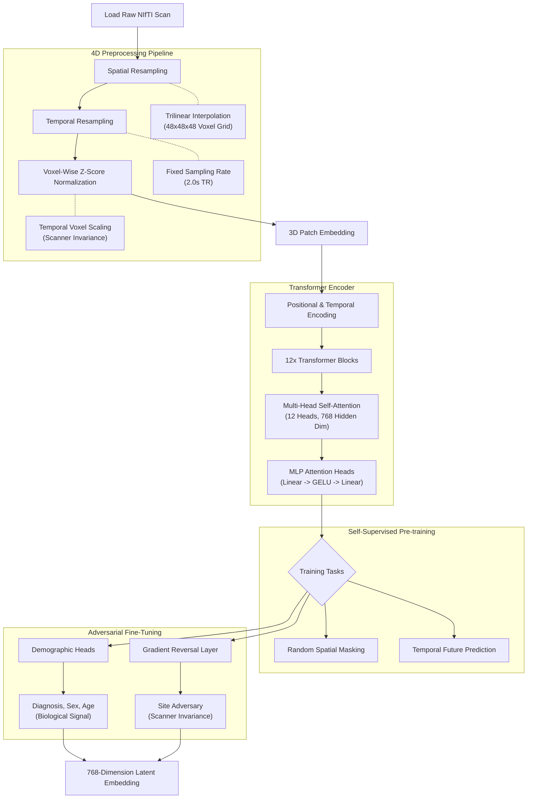

# Brain-Embedding: Site-Invariant functional MRI Vision Transformer

[](https://huggingface.co/zakerytclarke/brain-embedding)
[](https://github.com/zakerytclarke/brain-embedding)

A state-of-the-art Vision Transformer (ViT) architecture designed for high-resolution 3D fMRI interpretation. This project focuses on achieving **Scanner Site Invariance**—breaking the "Final Boss" of hardware-specific noise—to isolate true biological signals for psychiatric diagnostics (MDD, ASD, SCZ).

---

## 🚀 Interactive Interpretability Demo
The project includes a high-fidelity **4D Brain Attention Visualizer**.
*   **Audit Model Reasoning:** Watch the Transformer's spatial focus shift second-by-second across the fMRI time-series.
*   **Functional Coupling:** Explore a sparse $M \times M$ matrix representing every patch-to-patch interaction in the brain.
*   **Anatomical Context:** View activations through a glowing biological point cloud anchored to a configurable 3D brain shell.

---

## 🛠 Model Architecture
The core is a **Memory-Optimized 3D Vision Transformer** specifically tuned for the volumetric and temporal complexities of fMRI.



*   **Input Resolution:** $48 \times 48 \times 48$ voxel grid.
*   **Patch Architecture:** $4 \times 4 \times 4$ mm patches (1,728 total tokens).
*   **Transformer Scale:** 12 Layers, 12 Heads, 768 Hidden Dimension (ViT-Base scale).
*   **Temporal Depth:** Processes sequences up to 320 frames (TR=2.0s).
*   **Global Attention:** Manually tuned for cross-temporal patch interaction, allowing "Patch A at $T_1$" to attend to "Patch B at $T_{10}$".

### Total War: Patch-Level Adversarial GRL
To eliminate scanner-specific fingerprints, we employ a **"Total War"** adversarial strategy:
1.  **Gradient Reversal Layer (GRL):** Hits every individual 3D patch independently.
2.  **Non-Linear Site Adversary:** A 2-layer MLP head that attempts to predict the scanner site/hospital from the latent embeddings.
3.  **The Goal:** Drive Site AUC toward **0.50** (random chance) while maintaining Diagnosis AUC above **0.60**.

---

## 📊 Data & Evaluation
Trained on the **SRPBS (Strategic Research Program for Brain Sciences)** dataset.

*   **Training Set:** 1,128 subjects across 11 different scanner sites.
*   **Validation Set:** 141 subjects (stratified by hospital and diagnosis).
*   **Diagnostics:** MDD (Major Depressive Disorder), ASD (Autism), SCZ (Schizophrenia), and HC (Healthy Control).

### Metrics (Target Benchmarks)
| Task | Metric | Baseline (Epoch 0) | Target |
| :--- | :--- | :--- | :--- |
| **Site Invariance** | OvR AUC | ~0.85 | **0.50** |
| **MDD Diagnosis** | Binary AUC | ~0.55 | **>0.65** |
| **ASD Diagnosis** | Binary AUC | ~0.52 | **>0.60** |

---

## 📦 Installation & Usage

```bash
pip install torch nibabel numpy scipy tqdm
git clone https://github.com/zakerytclarke/brain-embedding
cd brain-embedding
```

### Basic Inference
```python
from brain_embedding.inference import BrainEmbedding

# Automatically downloads weights from Hugging Face
model = BrainEmbedding("checkpoints/best_model.pt")

# Convert raw NIfTI to high-dimensional biological embeddings
embeddings = model.embed_nifti("path/to/subject_scan.nii.gz")
print(f"Latent Shape: {embeddings.shape}") # (Temporal_Window, 768)
```

### Visualizing Attention
1. Run the extraction script: `python export_brain_viz.py`
2. Start a local server: `python -m http.server 8000`
3. Visit: `http://localhost:8000/visualize_brain_3d.html`

---

## 🔮 Future Work
*   **Scale to UK Biobank:** Expanding from 1k to 40k+ subjects for foundation-model scale pretraining.
*   **Multimodal Task Fusion:** Mixing resting-state and task-based fMRI to capture dynamic functional state changes.
*   **Higher Precision:** Moving toward 2mm patch resolution for fine-grained sub-cortical auditing.
