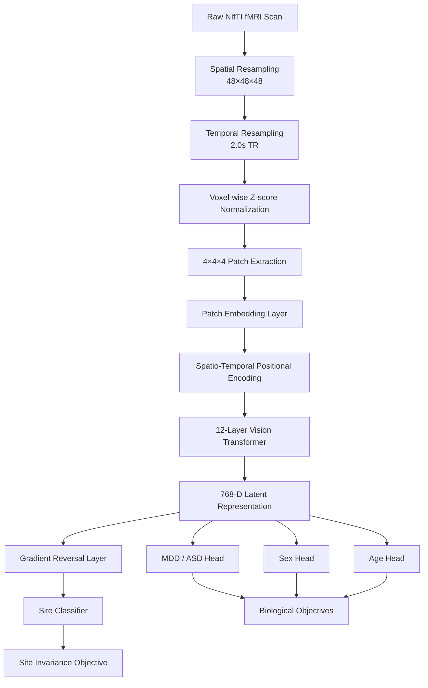

# Brain-Embedding: Site-Invariant 4D fMRI Vision Transformer

[](https://huggingface.co/zakerytclarke/brain-embedding)
[](https://github.com/zakerytclarke/brain-embedding)

A spatio-temporal Vision Transformer (ViT) for learning biologically meaningful representations from resting-state functional MRI (fMRI). The model combines transformer-based encoding with adversarial domain adaptation to reduce scanner-site information and improve cross-site generalization.

The resulting embeddings can be used for downstream prediction tasks including psychiatric diagnosis, demographic classification, and representation learning.

---

## Architecture

### Preprocessing

All fMRI scans are transformed into a standardized representation:

- Spatial resampling to a fixed 48 × 48 × 48 voxel grid
- Temporal resampling to a 2.0 second repetition time (TR)
- Voxel-wise temporal z-score normalization

The resulting tensor is represented as:

```text
X ∈ R^(T × 48 × 48 × 48)
```

where `T` denotes the number of temporal frames.

### Spatio-Temporal Transformer

The normalized volume is partitioned into overlapping 4 × 4 × 4 voxel patches and projected into a latent embedding space.

| Component | Value |
|------------|---------|
| Transformer Layers | 12 |
| Attention Heads | 12 |
| Hidden Dimension | 768 |
| Patch Size | 4 × 4 × 4 |
| Tokens per Frame | 1,728 |

Tokens from all temporal frames are processed jointly, enabling attention to model long-range spatial and temporal interactions throughout the scan.

### Site-Invariant Adversarial Training

The encoder is optimized using both biological prediction objectives and a site-classification adversary.

Training tasks include:

- Major Depressive Disorder (MDD)
- Autism Spectrum Disorder (ASD)
- Sex classification
- Age-group classification
- Scanner-site prediction

A Gradient Reversal Layer (GRL) is attached to latent patch representations and connected to a two-layer site-classification network. During optimization, reversed gradients encourage the encoder to learn representations that remain predictive for biological tasks while reducing scanner-site information.

The final encoder produces a 768-dimensional latent representation for downstream analysis.

---

## Model Diagram



---

## Datasets

### SRPBS

Training and evaluation were performed using the Strategic Research Program for Brain Sciences (SRPBS) dataset.

- 11 acquisition sites
- 1,128 training subjects
- 282 validation/test subjects

Source: https://bicr-resource.atr.jp/srpbsopen/

### Performance

| Task | Accuracy | AUC |
|--------|----------|--------|
| ASD Classification | 31.5% | 0.6509 |
| MDD Classification | 73.4% | 0.5907 |
| Age (<30) Classification | 66.0% | 0.5477 |

---

### External Validation (OpenNeuro ds002748)

To evaluate cross-site generalization, the model was tested on an external dataset not used during training.

- 67 subjects
- MDD and healthy control cohorts

Source: https://openneuro.org/datasets/ds002748/versions/1.0.5

### Performance

| Task | Accuracy | AUC |
|--------|----------|--------|
| MDD Classification | 71.4% | 0.6250 |
| Age (<30) Classification | 57.1% | 0.6875 |

These results suggest that learned representations retain predictive information when transferred to previously unseen acquisition environments.

---

## Interactive Visualization

The repository includes an interactive WebGL visualization environment for exploring learned representations and attention patterns.

Features include:

- Patch-to-patch attention visualization
- Distance-normalized connectivity maps
- Interactive 3D brain rendering
- Temporal exploration of fMRI activity

### Launching the Visualizer

```bash
python export_brain_viz.py

python3 -m http.server 8000
```

Open:

```text
http://localhost:8000/visualize_brain_3d.html
```

---

## Installation

```bash
git clone https://github.com/zakerytclarke/brain-embedding

cd brain-embedding

pip install torch nibabel numpy scipy scikit-learn tqdm
```

---

## Usage

```python
from brain_embedding.inference import BrainEmbedding

model = BrainEmbedding("brain_embedding_v1.pt")

embeddings = model.embed_nifti(
    "path/to/subject_scan.nii.gz"
)

print(embeddings.shape)
# (T, 768)
```

Pretrained weights are automatically downloaded from Hugging Face when local checkpoints are unavailable.

---

## Future Work

- Scaling to larger multi-site datasets including UK Biobank and ABCD
- Meta-learning approaches for rapid adaptation to unseen scanner environments
- Joint modeling of resting-state and task-based fMRI
- Higher-resolution representations for subcortical analysis
- Foundation-model pretraining across heterogeneous neuroimaging cohorts

---

