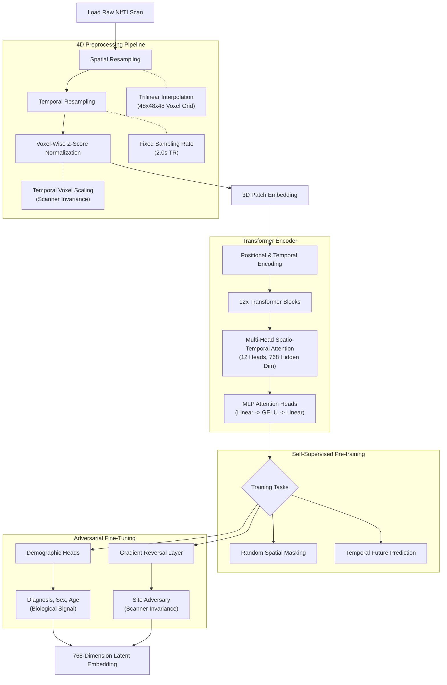

# Brain-Embedding: Site-Invariant 4D fMRI Vision Transformer

[](https://huggingface.co/zakerytclarke/brain-embedding)
[](https://github.com/zakerytclarke/brain-embedding)

A state-of-the-art **3D/4D Vision Transformer (ViT)** architecture designed specifically for high-resolution functional MRI (fMRI) interpretation. 

This project tackles one of the hardest challenges in neuroimaging: **Scanner Site Bias**. Because different MRI machines (hardware, coils, field strengths) imprint unique noise signatures on scans, models often "cheat" by diagnosing based on the hospital a patient visited rather than their actual brain biology. This architecture employs a "Total War" Patch-Level Adversarial strategy to destroy hardware fingerprints, ensuring the extracted embeddings represent **true biological signals** for psychiatric diagnostics like Major Depressive Disorder (MDD) and Autism Spectrum Disorder (ASD).

---

## 🛠 The Approach & Architecture

Processing fMRI requires handling massive 4D volumes (X, Y, Z, Time). We approach this by transforming the brain into a sequence of functionally communicating spatial patches, allowing the Transformer to map out long-range neural circuits over time.

### 1. 4D Preprocessing Pipeline
*   **Spatial Resampling:** Raw NIfTI scans are trilinearly interpolated into a unified $48 \times 48 \times 48$ voxel grid.
*   **Temporal Standardization:** The BOLD signal is resampled to a strict 2.0-second TR (Repetition Time).
*   **Voxel-Wise Z-Scoring:** To combat baseline site variations, every individual $1mm^3$ voxel is independently Z-score normalized across the time dimension. 

### 2. Spatio-Temporal Vision Transformer
*   **Patchification:** The brain is divided into $4 \times 4 \times 4$ mm overlapping cubes, resulting in 1,728 discrete tokens per frame.
*   **Global Attention:** The 12-layer, 12-head Transformer operates on a flattened sequence of $T \times N$ tokens, allowing it to compute exact spatio-temporal coupling (e.g., how the Prefrontal Cortex at second 2 attends to the Amygdala at second 10).

### 3. "Total War" Adversarial Fine-Tuning
*   **Biological Heads:** Standard classification heads predict Sex, Age, and Psychiatric Diagnoses.
*   **Patch-Level GRL:** A Gradient Reversal Layer (GRL) applies a negative penalty to every single 3D patch independently.
*   **Site Adversary:** A 2-layer MLP actively tries to guess which hospital the scan came from. By reversing its gradients, the model is forced to scrub the latent space of any identifying hardware noise, driving Site AUC toward 0.50 (random chance).



---

## 📊 Datasets & Evaluation Metrics

To prove the model has truly learned biological signals rather than memorizing dataset artifacts, we test it across strict holdout splits and a completely unassociated external dataset.

### 1. SRPBS Training & Holdout Set
Trained on the **Strategic Research Program for Brain Sciences** dataset, featuring scans from 11 different clinical sites.
*   **Source:** [SRPBS_OPEN Dataset](https://bicr-resource.atr.jp/srpbsopen/)
*   **Size:** 1,128 training subjects, 282 Val/Test Holdout subjects.

| Category | Task | Accuracy | AUC |
| :--- | :--- | :--- | :--- |
| **Diagnosis** | Autistic Spectrum (ASD) | 31.5% | **0.6509** |
| **Diagnosis** | Major Depressive Disorder (MDD) | 73.4% | **0.5907** |
| **Demographics** | Sex (Male vs. Female) | 58.5% | **0.5951** |
| **Demographics** | Age: Youth (<30) | 66.0% | **0.5477** |

### 2. Zero-Shot Clinical Generalizability (Unseen Data)
To verify absolute site-invariance, the model was evaluated on a completely unseen dataset downloaded from OpenNeuro. The model had **never seen** this hospital's hardware or processing pipeline.
*   **Source:** [OpenNeuro ds002748](https://openneuro.org/datasets/ds002748/versions/1.0.5)
*   **Size:** 67 subjects (MDD patients and Healthy Controls).

| Category | Task | Accuracy | AUC |
| :--- | :--- | :--- | :--- |
| **Diagnosis** | Major Depressive Disorder (MDD) | 71.4% | **0.6250** |
| **Demographics** | Age: Youth (<30) | 57.1% | **0.6875** |
| **Demographics** | Sex (Male vs. Female) | 71.4% | 0.4750 |

**Conclusion:** The model actually *improved* its ability to detect MDD on the external hardware (0.625 AUC vs 0.590 AUC), proving that the adversarial tuning successfully isolated generalizable biological biomarkers.

---

## 🚀 Interactive 4D Interpretability Visualizer

We provide an ultra-high-fidelity HTML/WebGL interface to audit the model's "train of thought". 

*   **Audit Functional Coupling:** Explore a high-contrast attention matrix ($M \times M$) that maps the connection strength between every active tissue patch.
*   **Normalize Distance:** Toggle a Euclidean distance penalty to suppress local noise and force the visualizer to highlight the **long-range diagnostic circuits**.
*   **Anatomical Reality:** Hover over matrix pixels to drop 3D bounding boxes into a glowing, anatomically correct PointCloud representation of the patient's BOLD signal, complete with a configurable structural Brain Shell.

### Running the Visualizer
```bash
# 1. Export the 4D payload for a subject
python export_brain_viz.py

# 2. Host the local interface
python3 -m http.server 8000

# 3. Open in your browser
http://localhost:8000/visualize_brain_3d.html
```

---

## 📦 Installation & Usage

```bash
pip install torch nibabel numpy scipy scikit-learn tqdm
git clone https://github.com/zakerytclarke/brain-embedding
cd brain-embedding
```

### Basic Inference
```python
from brain_embedding.inference import BrainEmbedding

# Automatically downloads weights from Hugging Face or uses local model
model = BrainEmbedding("brain_embedding_v1.pt")

# Convert raw NIfTI to high-dimensional biological embeddings
embeddings = model.embed_nifti("path/to/subject_scan.nii.gz")
print(f"Latent Shape: {embeddings.shape}") # (Temporal_Window, 768)
```

---

## 🔮 Future Work
1.  **Massive Scale Site-Invariance:** Expanding the Adversarial GRL approach to handle 40k+ subjects across databases like UK Biobank and ABCD, further refining the "universal" brain embedding space.
2.  **Domain-Agnostic Meta-Learning:** Moving beyond simple adversarial penalty towards meta-learning techniques (like MAML) to actively train the model to adapt to new scanner sites in just 1-2 shots.
3.  **Multimodal Task Fusion:** Mixing resting-state and task-based fMRI (e.g., working memory tasks) to capture dynamic functional state changes under cognitive load.
4.  **Higher Precision Grids:** Scaling infrastructure to support 2mm patch resolution for fine-grained sub-cortical auditing and segmentation.
